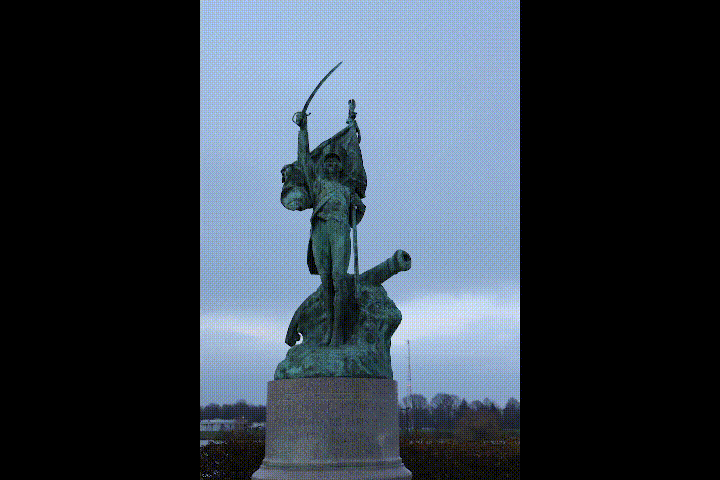

# CV Project: 3D Reconstruction of an object

Ce projet à pour vocation de d'automatiser la chaîne de photogrammétrie afin de la rendre accessible au plus grand nombre. Nous nous sommes basés sur la suite logicielle <a href = "https://micmac.ensg.eu/"> MicMac </a> développée par l'IGN et l'ENSG.
    
Nous ajoutons à cela des outils de traitement d'image permettant notamment de détecter le sujet et de de reconstruire automatiquement.

Notre contribution est ainsi de rendre accessible la photogrammétrie à ceux qui ne sont pas formés à cet art et qui sont désireux d'un outil utilisable en une commande.




**Néanmoins, notre outil n'est pas magique et un ensemble d'images non adapté à la photogrammétrie donne des résultats faux ou des erreurs.**

## Usage

Dans le répertoire du projet, il suffit d'exécuter la commande suivante:
```
    python pipelineLinux.py [--with_masks] ./ExampleSets/StatueHQ
```

Avec le chemin vers votre dossier d'images.
Notre script va ensuite dérouler seul toute la chaîne de photogrammétrie. 

## Masquage automatique


Avec l'option ``` --with_masks ``` le script génère des masques qui vont permettre de filtrer les points n'appartenant pas au sujet. Cela est fait à l'aide d'un modèle développé par [Xuebin Qin](https://xuebinqin.github.io/), [Hang Dai](https://scholar.google.co.uk/citations?user=6yvjpQQAAAAJ&hl=en), [Xiaobin Hu](https://scholar.google.de/citations?user=3lMuodUAAAAJ&hl=en), [Deng-Ping Fan*](https://dengpingfan.github.io/), [Ling Shao](https://scholar.google.com/citations?user=z84rLjoAAAAJ&hl=en), [Luc Van Gool](https://scholar.google.com/citations?user=TwMib_QAAAAJ&hl=en) pour le papier de recherche [Highly Accurate Dichotomous Image Segmentation （ECCV 2022）](https://arxiv.org/pdf/2203.03041.pdf)  


# Installation

Simply clone the main repository

```
    git clone https://github.com/MesmerV/3DReconstruction.git
```

Il faut ensuite installer les dépendances 

## Linux

MicMac fonctionne mieux sous Linux, c'est donc l'OS à préférer pour utiliser ce script.


* Intallation de MicMac : https://micmac.ensg.eu/index.php/Install 

* Pour utiliser le masquage automatique, il faut un environnement Python plus spécifique.
Si vous utilisez Anaconda:

```
conda env create -f torch18
conda activate torch 18
```
Sinon référez vous à torch18.yml pour les dépendances


## Windows 

Le script n'est pas (encore) fonctionnel sous windows mais peut être rendu compatible.
Sous réserve de l'installation de MicMac

* Intallation de MicMac : https://micmac.ensg.eu/index.php/Install 

Il faudra également avoir un environnement pytorch pour l'exécution du masquage automatique (pas de yml fourni)

# Fonctionnement

## Préparation de l'environnement de travail

* On commence par copier les images cibles dans un dossier isolé appelé "workspace" dans lequel tous les calculs seront faits.

 * Si l'option ``` --with_masks ``` est donnée en argument alors on génère à ce moment les masques pour chacune de nos images.


# Déroulé de la pipeline MicMac

On détaille ici toutes les commandes utilisées lors de l'exécution du programme ou celles qui peuvent être utile.

## Calcul des points homologues - Tapioca

```
mm3d Tapioca MulScale ".*jpg" 500 2500
```

" "Il semble accepté que la plus haute résolution soit de l’ordre du tiers à la moitié de la résolution des photographies ». -> éviter les détails trop précis qui varient dune image à l'autre ...
 
mieux sans les images masquées car on garde les métadonnées et en vrai il y a plus de points caractéristiques pour la convergence.

Homol contient les informations sur les points clés trouvés (Tapioca)


## Filtrage - Schnaps

Avec loutil Schnaps on s'assure que chaque image contient au moins 100 points homologues trouvés par tapioca, on écarte les images n'en contenant pas assez car elles risquent de poser problème lors du calcul des orientations.

```
    mm3d Schnaps .*jpg NbWin=100 MoveBadImgs=1 
```

## Calcul des positions et des orientations - Tapas

On utilise la commande suivante
```
mm3d Tapas Fraser ".*jpg" Out=Project
```

On peut aussi utiliser RadialBasic, RadialStd ou RadialExtended à la place de Fraser. voir <a href="https://micmac.ensg.eu/index.php/Tapas"> la documentation MicMac </a> 
vous pouvez aussi exécuter la commmande suivante pour vérifier les résultats de Tapas.


```
mm3d AperiCloud .*jpg Project
```


## Filtrage des points homologues – HomolFilterMasq

Le programme HomolFilterMasq permet de filtrer les points homologues, et de ne conserver que les points homologues contenus à l’intérieur d’un certain volume. 
```
mm3d HomolFilterMasq .*jpg
```

## C3DC pour reconstruire le nuage de points dense

[Documentation](https://micmac.ensg.eu/index.php/C3DC) 

La commande C3DC est un assemblage complexe qui calcule des cartes de profondeur pour chaque image, et génère un nuage de points dense. Elle fusionne ensuite 
```
mm3d C3DC MicMac .*png Projet
```


```
mm3d C3DC MicMac .*jpg Projet SH=MasqFiltered
```

# Autres commandes utiles

MicMac a alors généré un nuage de points dense à partir de vos images !
Vous pouvez le visualiser avec [MeshLab](https://www.meshlab.net/) par exemple.

Il y a souvent besoin de filtrer les points du décor avant de lancer la recontruction du maillage.

## TiPunch pour reconstruire un maillage

On utilise la reconstruction de Poisson:

```
mm3d TiPunch PointCloud.ply Filter=false Depth=9

```
## Tequila pour appliquer une texture au mesh

[Documentation](https://micmac.ensg.eu/index.php/Tequila)

On peut choisir d'appliquer une texture à la fois (on indique le nom) ou tenter de toutes les plaquer en même temps

```
mm3d Tequila .*JPG Projet your_mesh.ply

```

# Sources

 * Site officiel de MicMac : https://micmac.ensg.eu/index.php/Accueil 

 * Tutoriel explicatif pour l'utilisation de MicMac:  http://bestrema.fr/micmac-tutoriel-et-script-pour-photogrammetrie-sous-windows/ 
 
 * Réseau DIS-Net pour le calcul automatique de masques

## notes 

statue4 -> 700 2400 ok

vanneau 700 2500 pas ok

Vanneau 844 2480 s 600 erreur tapas

StatueHQ 844 2480 s 600 ok


